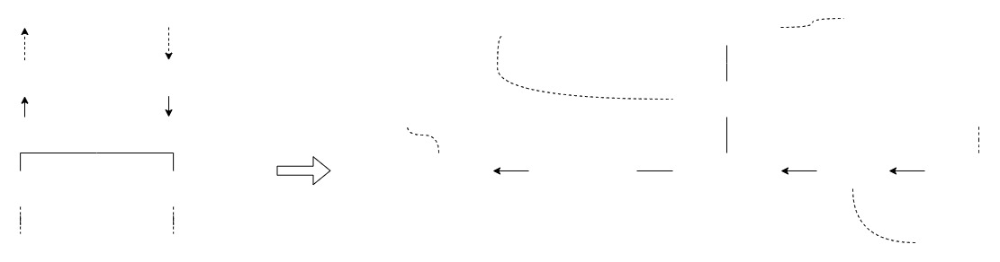

# 🚀 Case - OZmap Integration ISP

Serviço backend em Node.js 20 com TypeScript, ESLint, Prettier e Commits Semânticos.

---

## Arquitetura



O mapeamento utilizado para converter os dados no esperado pelo OZMap segue de acordo com o diagrama abaixo:


## 📦 Tecnologias

- Node.js 20
- TypeScript
- ESLint + Prettier
- Husky + Commitlint
- Commitizen + Conventional Commits

---

## 🌱 Variáveis de Ambiente

A aplicação depende das seguintes variáveis de ambiente para funcionar corretamente:

| Variável              | Obrigatória | Descrição                                                   |
| --------------------- | ----------- | ----------------------------------------------------------- |
| `DATABASE_URL`        | Sim         | URL de conexão com o banco de dados do MongoDB.             |
| `SERVICE_INTERVAL`    | Sim         | Intervalo de execução do serviço (em minutos).              |
| `IMPORTER_GW_URL`     | Sim         | URL base do gateway HTTP utilizado pelo importador.         |
| `EXPORTER_GW_URL`     | Sim         | URL base do gateway HTTP utilizado pelo exportador.         |
| `EXPORTER_GW_API_KEY` | Sim         | Chave de autenticação para acessar o gateway do exportador. |
| `LOG_LEVEL`           | Não         | Nível de log (`debug`, `info`, `warn`, `error`).            |
| `LOG_FILE_PATH`       | Não         | Caminho do arquivo onde os logs serão persistidos.          |

---

## ✅ Scripts

| Comando           | Descrição                                |
| ----------------- | ---------------------------------------- |
| `npm install`     | Instala as dependências                  |
| `npm run build`   | Compila o código TypeScript para `dist/` |
| `npm run lint`    | Executa o ESLint                         |
| `npm run format`  | Formata os arquivos com Prettier         |
| `npm run prepare` | Instala os hooks do Husky                |
| `npm run commit`  | Inicia o commit semântico (Commitizen)   |

---

## 🧪 Commits Semânticos

Tipos suportados

- feat: nova funcionalidade
- fix: correção de bug
- docs: apenas documentação
- style: formatação, espaços, ponto e vírgula, etc.
- refactor: refatoração de código (sem mudança de comportamento)
- test: testes adicionados ou corrigidos
- chore: tarefas de build ou configuração
- perf: melhoria de performance
- ci: configurações de CI/CD

### Exemplos

```bash
# Válido
feat(api): adicionar endpoint de login

# Com breaking change
feat(auth): adicionar novo fluxo de token

BREAKING CHANGE: estrutura de autenticação anterior foi removida
```

### Uso

Para criar um commit:

```bash
npm run commit
```

---

## ⚙️ Build

Usa tsconfig.build.json para gerar build limpo e isolado:

```bash
npm run build
```

Arquivos de testes, mocks, etc. são excluídos da build final.

---

## 🐳 Docker (Build e Deploy)

A aplicação pode ser containerizada usando Docker com suporte a PM2 e Prisma. Siga os passos abaixo para build e execução:

### 📦 Build da Imagem

```bash
docker build -t minha-aplicacao .
```

Substitua minha-aplicacao pelo nome desejado para sua imagem.

### 🚀 Execução do Container

```bash
docker run \
  -e DATABASE_URL= \
  -e SERVICE_INTERVAL=30000 \
  -e IMPORTER_GW_URL=https://importador.exemplo.com \
  -e EXPORTER_GW_URL=https://exportador.exemplo.com \
  -e EXPORTER_GW_API_KEY=abc123 \
  -e LOG_LEVEL=debug \
  -e LOG_FILE_PATH=/logs/app.log \
  -p 3000:3000 \
  minha-aplicacao
```

Todos os valores de variáveis de ambiente podem ser definidos diretamente no comando ou via arquivo .env com --env-file .env.

## 🔄 Build para Produção

A imagem é otimizada para produção, usando:

- Node 20 Alpine

- Yarn como gerenciador de pacotes

- PM2 como gerenciador de processo

- Usuário sem privilégios de root (execução segura)

- Geração de client do Prisma no build

## 📁 Volume de Logs (opcional)

Para persistir os logs fora do container:

```bash
docker run -v ./logs:/logs \
-e LOG_FILE_PAHT=/logs/application.log \
minha-aplicacao
```

## Notas

- Há inconsitências em relação ao estado dos dados aninhando durante o processamento
- Adicionado um Gateway de Mock da coneŋo com o OZmao
